# 02 — Data Model & ERD (PostgreSQL)

Read `00-overview.md` (§4 tenancy) and `01-modules-functional-spec.md` first.
Conventions used throughout:

- All tables use `id uuid PRIMARY KEY DEFAULT gen_random_uuid()`.
- Every tenant-owned table has `tenant_id uuid NOT NULL REFERENCES tenants(id)`,
  indexed as the leading column of every composite index on that table, and
  covered by an EF Core global query filter — **never query a tenant-owned
  table without it being tenant-filtered.**
- `created_at`, `updated_at` (`timestamptz`, UTC) + `created_by`, `updated_by`
  (`uuid`, nullable for system actions) on every table.
- Soft-delete via `is_deleted boolean DEFAULT false` + `deleted_at` on
  master-data tables (Employee, Department, etc.) — never hard-delete data
  with historical/legal relevance; hard-delete only where GDPR erasure
  explicitly requires it, via a dedicated purge process, not a normal DELETE.
- Money fields (once payroll exists): `numeric(14,2)` + a `currency` char(3),
  never `float`.

## High-level ERD (Mermaid)

```mermaid
erDiagram
    TENANTS ||--o{ USERS : has
    TENANTS ||--o{ LOCATIONS : has
    TENANTS ||--o{ DEPARTMENTS : has
    TENANTS ||--o{ DESIGNATIONS : has
    TENANTS ||--o{ EMPLOYEES : has
    TENANTS ||--o{ LEAVE_TYPES : has
    TENANTS ||--o{ WORKFLOW_REQUESTS : has

    USERS ||--o| EMPLOYEES : "is (optional)"
    ROLES ||--o{ USER_ROLES : grants
    USERS ||--o{ USER_ROLES : has
    ROLES ||--o{ ROLE_PERMISSIONS : grants
    PERMISSIONS ||--o{ ROLE_PERMISSIONS : "granted via"

    DEPARTMENTS ||--o{ DEPARTMENTS : "parent of"
    DEPARTMENTS ||--o{ EMPLOYEES : contains
    LOCATIONS ||--o{ EMPLOYEES : "based at"
    DESIGNATIONS ||--o{ EMPLOYEES : holds
    EMPLOYEES ||--o{ EMPLOYEES : "manages (self-ref)"

    EMPLOYEES ||--o{ EMPLOYEE_DOCUMENTS : has
    EMPLOYEES ||--o{ EMPLOYEE_CUSTOM_FIELD_VALUES : has
    CUSTOM_FIELD_DEFINITIONS ||--o{ EMPLOYEE_CUSTOM_FIELD_VALUES : defines

    CANDIDATES ||--o| EMPLOYEES : "converts to"
    CANDIDATES ||--o{ ONBOARDING_TASKS : has

    EMPLOYEES ||--o{ LEAVE_BALANCES : has
    LEAVE_TYPES ||--o{ LEAVE_BALANCES : "balance of"
    LEAVE_POLICIES ||--o{ LEAVE_TYPE_POLICY_RULES : configures
    LEAVE_TYPES ||--o{ LEAVE_TYPE_POLICY_RULES : "rule for"

    EMPLOYEES ||--o{ ATTENDANCE_RECORDS : logs
    SHIFTS ||--o{ SHIFT_ASSIGNMENTS : "assigned via"
    EMPLOYEES ||--o{ SHIFT_ASSIGNMENTS : has

    EMPLOYEES ||--o{ GOALS : owns
    EMPLOYEES ||--o{ OBJECTIVES : owns
    OBJECTIVES ||--o{ KEY_RESULTS : has
    OBJECTIVES ||--o| OBJECTIVES : "aligns to parent"

    EMPLOYEES ||--o{ WORKFLOW_REQUESTS : submits
    WORKFLOW_REQUESTS ||--o{ WORKFLOW_APPROVAL_STEPS : has
    EMPLOYEES ||--o{ WORKFLOW_APPROVAL_STEPS : "acts as approver"

    PROJECTS ||--o{ PROJECT_TASKS : has
    EMPLOYEES ||--o{ TIMESHEETS : submits
    TIMESHEETS ||--o{ TIMESHEET_ENTRIES : has
    PROJECTS ||--o{ TIMESHEET_ENTRIES : "logged against"

    EMPLOYEES ||--o{ EMPLOYEE_SALARY_ASSIGNMENTS : has
    SALARY_STRUCTURES ||--o{ EMPLOYEE_SALARY_ASSIGNMENTS : "assigned via"
    SALARY_STRUCTURES ||--o{ SALARY_STRUCTURE_COMPONENTS : has
    PAY_COMPONENTS ||--o{ SALARY_STRUCTURE_COMPONENTS : "used in"
    PAYROLL_RUNS ||--o{ PAYROLL_RUN_ITEMS : has
    EMPLOYEES ||--o{ PAYROLL_RUN_ITEMS : "paid in"
    PAYROLL_RUN_ITEMS ||--o{ PAYROLL_RUN_ITEM_LINES : has
    PAYROLL_RUN_ITEMS ||--o| PAYSLIPS : generates
    EMPLOYEES ||--o{ INVESTMENT_DECLARATIONS : declares

    EMPLOYEES ||--o{ NOTIFICATIONS : receives
    EMPLOYEES ||--o{ AUDIT_LOGS : "acted in"
```



---

## Table-by-table schema

### Platform
**`tenants`**
| column | type | notes |
|---|---|---|
| id | uuid PK | |
| name | text | legal/display name |
| subdomain | citext UNIQUE | e.g. `acme` → acme.peoplehq.app |
| plan_id | uuid FK → plans | |
| status | text | Trial / Active / Suspended / Cancelled |
| timezone | text | IANA tz, org default |
| industry | text | nullable |
| logo_blob_url | text | nullable |
| email_verified | boolean | gates outbound comms, per recording |
| created_at | timestamptz | |

**`plans`** — id, name (Starter/Growth/Enterprise), seat_limit, price, `features jsonb` (flag map consumed by a `FeatureGate` service).

### Identity
**`users`** — id, tenant_id, email (citext), password_hash, mfa_enabled,
mfa_secret (encrypted), status (Invited/Active/Disabled), last_login_at.
Unique on `(tenant_id, email)`.

**`roles`** — id, tenant_id (nullable = system default role, cloned per
tenant on creation), name, is_system.
**`permissions`** — id, key (e.g. `employee.write`, `leave.approve`), description.
**`role_permissions`** — role_id, permission_id (composite PK).
**`user_roles`** — user_id, role_id (composite PK).

### Org Structure
**`locations`** — id, tenant_id, name, address, timezone, holiday_calendar_id FK.
**`holiday_calendars`** / **`holidays`** — calendar id+name; holidays: calendar_id, date, name, is_optional.
**`departments`** — id, tenant_id, name, parent_department_id (self-FK, nullable), head_employee_id FK nullable.
**`designations`** — id, tenant_id, title, grade (int, nullable).

### Employees
**`employees`**
| column | type | notes |
|---|---|---|
| id | uuid PK | |
| tenant_id | uuid FK | |
| user_id | uuid FK → users | nullable until account activated |
| employee_code | text | tenant-scoped unique, human-readable (e.g. `EMP-0019`) |
| first_name, last_name | text | |
| date_of_birth | date | nullable |
| personal_email, work_email, phone | text | |
| department_id, location_id, designation_id | uuid FK | |
| manager_id | uuid FK → employees | self-ref, nullable (CEO/top has null) |
| employment_type | text | FullTime/PartTime/Contractor |
| join_date | date | |
| exit_date | date | nullable |
| status | text | Invited/Active/OnLeave/Suspended/Exited |
| is_deleted | boolean | soft delete |

Indexes: `(tenant_id, manager_id)` for org-chart/reportee queries,
`(tenant_id, department_id)`, `(tenant_id, status)`.

**`employee_documents`** — id, employee_id, tenant_id, doc_type
(IdProof/Contract/Certification/Other), blob_url, uploaded_at, expires_at (nullable — for cert expiry alerts).

**`employee_skills`** — id, employee_id, name, level (nullable), expires_at (nullable). *("Beyond Zoho" addition, §D.)*

**`custom_field_definitions`** — id, tenant_id, entity ("Employee"), label, field_type (Text/Number/Date/Dropdown/Checkbox), options (jsonb, for Dropdown), is_required.
**`employee_custom_field_values`** — employee_id, field_definition_id, value (text; cast per field_type in application layer).

### Onboarding
**`candidates`** — id, tenant_id, name, email, phone, resume_blob_url, designation_id (nullable), source, stage (OfferSent/Accepted/DocsCollected/ReadyToOnboard/Converted/Rejected), converted_employee_id (nullable FK).
**`onboarding_checklist_templates`** — id, tenant_id, name, applies_to_department_id (nullable), applies_to_designation_id (nullable).
**`onboarding_checklist_items`** — template_id, title, owner_role, due_offset_days (relative to join date).
**`onboarding_tasks`** — id, tenant_id, candidate_id or employee_id, title, owner_employee_id (nullable), due_date, status (Pending/Done), source_item_id FK nullable.

### Leave
**`leave_types`** — id, tenant_id, name, accrual_type (Fixed/Monthly), annual_entitlement (numeric), carry_forward_cap (numeric, nullable), requires_document_after_days (int, nullable).
**`leave_policies`** — id, tenant_id, name, applies_to (jsonb rule: department/location/employment_type filters).
**`leave_type_policy_rules`** — policy_id, leave_type_id, entitlement_override (nullable).
**`employee_leave_policy`** — employee_id, policy_id (which policy an employee is under).
**`leave_balances`** — employee_id, leave_type_id, year, accrued, used, carried_forward. Composite PK `(employee_id, leave_type_id, year)`.
**`leave_requests`** — id, tenant_id, employee_id, leave_type_id, start_date, end_date, is_half_day, reason, attachment_blob_url (nullable), status, workflow_request_id FK (see below).

### Attendance
**`shifts`** — id, tenant_id, name, start_time, end_time, grace_minutes, break_minutes.
**`shift_assignments`** — employee_id, shift_id, effective_from, effective_to (nullable — supports rotation history).
**`attendance_records`** — id, tenant_id, employee_id, date, check_in_at, check_out_at, check_in_geo (point, nullable), source (Web/Mobile/Biometric), status (Present/Absent/HalfDay/OnLeave).
**`attendance_regularization_requests`** — id, tenant_id, attendance_record_id, employee_id, requested_check_in, requested_check_out, reason, workflow_request_id FK.

### Performance / OKR
**`goals`** — id, tenant_id, employee_id, title, description, target_date, progress_percent, status.
**`okr_cycles`** — id, tenant_id, name (e.g. "Q1 2027"), start_date, end_date.
**`objectives`** — id, tenant_id, cycle_id, owner_employee_id (nullable if team/company-level), owner_department_id (nullable), title, parent_objective_id (nullable, for alignment).
**`key_results`** — id, objective_id, title, metric_type (Percent/Number/Boolean), start_value, target_value, current_value.
**`feedback_notes`** — id, tenant_id, from_employee_id, to_employee_id, message, visibility (Public/ManagerOnly), created_at. *(Beyond Zoho, §I.)*

### Generic Workflow Engine (backs Leave/Regularization/HR Process/Travel/Exit)
**`workflow_requests`**
| column | type | notes |
|---|---|---|
| id | uuid PK | |
| tenant_id | uuid FK | |
| request_type | text | LeaveRequest / Regularization / DepartmentChange / LocationChange / DesignationChange / TravelRequest / TravelExpense / ExitRequest |
| requester_employee_id | uuid FK | |
| payload | jsonb | type-specific fields |
| status | text | Draft/Pending/Approved/Rejected/Cancelled/Withdrawn |
| current_step_order | int | |
| submitted_at, resolved_at | timestamptz | |

**`workflow_approval_steps`** — id, workflow_request_id, step_order, approver_employee_id, mode (Sequential/AnyOf/AllOf group id), status (Pending/Approved/Rejected/Skipped), acted_at, comment.
**`workflow_chain_rules`** — id, tenant_id, request_type, rule (jsonb: e.g. `{"approver":"direct_manager"} `, `{"approver":"department_head","if":"days>5"}`) — drives the no-code chain builder from §J.

### Timesheet (Phase 1)
**`projects`** — id, tenant_id, name, code (unique per tenant), client_name (nullable), billable_default (boolean), is_active.
**`project_tasks`** — id, project_id, name, is_billable (nullable override of project default).
**`timesheets`** — id, tenant_id, employee_id, period_start, period_end, entry_mode (Simple/Detailed), status (Draft/Submitted/Approved/Rejected), workflow_request_id FK nullable. Unique on `(employee_id, period_start, period_end)`.
**`timesheet_entries`** — id, timesheet_id, work_date, project_id (nullable if Simple mode), task_id (nullable), hours (numeric(4,2)), is_overtime (boolean), is_billable (boolean), description (nullable).

### Payroll & Compensation (Phase 1)
**`pay_components`** — id, tenant_id, name, component_type (Earning/Deduction), amount_type (Flat/PercentOfBasic/PercentOfCTC/Formula), formula (jsonb, nullable — used when amount_type=Formula), is_taxable (boolean), is_statutory (boolean, flags PF/ESI-type system components), sort_order.
**`salary_structures`** — id, tenant_id, name, description.
**`salary_structure_components`** — salary_structure_id, pay_component_id, default_value (numeric — interpreted per the component's amount_type), sort_order. Composite PK.
**`employee_salary_assignments`** — id, tenant_id, employee_id, salary_structure_id, pay_type (Salaried/Hourly/Contract), ctc_annual (numeric(14,2)), currency (char(3)), effective_from (date), effective_to (date, nullable). Never updated in place — a revision inserts a new row and closes the prior one's `effective_to`.
**`employee_salary_component_values`** — assignment_id, pay_component_id, computed_amount (numeric(14,2)) — snapshot of each component's resolved value as of the assignment's effective date.
**`statutory_settings`** — id, tenant_id, country_code (default `IN`), config (jsonb: PF employee/employer %, PF wage ceiling, ESI threshold + %, TDS regime defaults) — the pluggable-by-country extension point referenced throughout §O.
**`pt_slabs`** — id, tenant_id, state, min_income, max_income, tax_amount — India Professional Tax, state-wise.
**`investment_declarations`** — id, tenant_id, employee_id, financial_year, section (e.g. `80C`/`80D`/`HRA`), declared_amount, proof_blob_url (nullable), status (Declared/ProofSubmitted/Verified/Rejected), verified_by (nullable), verified_at (nullable).
**`payroll_runs`** — id, tenant_id, period_month, period_year, status (Draft/Computed/PendingApproval/Approved/Locked/Paid), workflow_request_id FK nullable, locked_at, paid_at. Unique on `(tenant_id, period_month, period_year)`.
**`payroll_run_items`** — id, payroll_run_id, employee_id, gross_earnings, total_deductions, net_pay, employer_pf, employer_esi, lop_days (numeric — loss-of-pay days from Attendance/Leave), payment_status (Pending/Paid/Failed), overridden_by (nullable, uuid → users), override_reason (nullable, required if any line under it is a manual override).
**`payroll_run_item_lines`** — id, payroll_run_item_id, pay_component_id, amount, is_manual_override (boolean).
**`payslips`** — id, tenant_id, employee_id, payroll_run_item_id FK, pdf_blob_url, generated_at, ytd_gross, ytd_tax. Immutable once generated (§O).
**`full_final_settlements`** — id, tenant_id, employee_id, exit_workflow_request_id FK, computed_at, net_settlement_amount, payslip_id FK (nullable — points at a payslip flagged as a settlement, not a regular cycle).

### Notifications & Audit
**`notifications`** — id, tenant_id, recipient_employee_id, category, title, body, link, is_read, created_at.
**`notification_preferences`** — employee_id, category, channel (InApp/Email), enabled.
**`audit_logs`** — id, tenant_id, actor_user_id (nullable=system), entity_name, entity_id, action (Create/Update/Delete/StatusChange), diff (jsonb before/after), created_at. Indexed `(tenant_id, entity_name, entity_id)`.

### Engagement / Extras (§ "most needed options")
**`surveys`** / **`survey_responses`** — single-question pulse/eNPS surveys, anonymous flag.
**`assets`** — id, tenant_id, name, serial_no, assigned_employee_id (nullable), status (InStock/Assigned/Returned/Retired).
**`helpdesk_tickets`** — id, tenant_id, raised_by_employee_id, category, subject, description, status, assigned_to_employee_id, sla_due_at.
**`announcements`** — id, tenant_id, title, body, audience (jsonb filter: all/department/location), published_at.

---

## Key modeling decisions worth calling out
1. **`workflow_requests.payload` is JSONB, not a table-per-request-type.**
   This keeps the approval engine generic (§J). Strongly-typed read models
   (e.g. a `LeaveRequestView`) are built in the Application layer by joining
   `workflow_requests` back to a dedicated detail table via
   `workflow_request_id` wherever the request type has its own independent
   lifecycle/data model — this is the case for Leave (`leave_requests`),
   Attendance Regularization (`attendance_regularization_requests`),
   Timesheet Approval (`timesheets`), and Payroll Run Approval
   (`payroll_runs`). For the simpler HR Process types (Department/Location/
   Designation change, Travel — Phase 2), the JSONB payload *is* the
   record — no separate detail table needed since they have no
   independent lifecycle outside the workflow.
2. **Effective-dated history** on `shift_assignments` and (recommended)
   on `employees.manager_id` / `department_id` changes — model org-structure
   changes as new rows in an `employee_position_history` table rather than
   overwriting `employees` in place, so "who was employee X's manager on
   date Y" is answerable. Add `employee_position_history` (employee_id,
   department_id, designation_id, location_id, manager_id, effective_from,
   effective_to) if/when this is needed — flagged here so it isn't a
   surprise schema change later.
3. **Global query filter example (EF Core):**
   ```csharp
   modelBuilder.Entity<Employee>()
       .HasQueryFilter(e => e.TenantId == _tenantContext.TenantId && !e.IsDeleted);
   ```
   Apply the same pattern to every tenant-owned entity via a shared base
   configuration, not copy-pasted per entity.
4. **Do not put `tenant_id` on truly global tables** (`plans`, `permissions`,
   `holiday_calendars` templates if you ship starter templates) — only
   tenant-owned data carries it.
